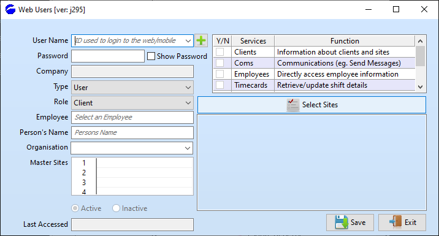

# Powerforce logical DB structure
- Powerforce can be configured on a many logical entity per physical database setup.  
- Access to data for desktop Powerforce users is based around the logical entities a user may have access to.  

This means that one physical database may host multiple ABN based business entities.  

- And what this means to REST access, is that the user must be authenticated to provide details of the logical entity to which they belong.    
- A desktop user is generally not an employee that is roster managed through Powerforce. Whilst it can absolutely be so, in this document the desktop user if effectively the system adminstrator and operations roles.

# Web User configuration

- The Powerforce REST interface enforces user authentication for access purposes as well as to define the company to which they belong.  
- To accommodate this, Powerforce has a simple access control management function which 

- The following screen details the configuration information required to enable individual user access to Powerforce.

## Basic Concepts
- The ‘role’ indicates whether they are an ‘employee’ or a ‘client’ which is the overarching control over what type of services they have available to them.
- The ‘type’ indicates the level of user be they a ‘user’, ‘manager’ or ‘administrator’. However the type controls what ‘role’ options they have.

- If the ‘type’ is ‘administrator’ then the role can only be ‘administrator’. This is for either developers or system functions that require complete access to all options.
- If the ‘type’ is ‘manager’ then the ‘role’ can only be ‘client’. This is for site managers whether they be internal or from the client
- If the ‘type’ is ‘user’ then the ‘role’ can be either ‘employee’ or ‘client’. A ‘client user’ has basically the same permissions as ‘client manager’. An ‘employee user’ has access to their own info.

- Many options are available for both employees and clients via the timecards service which deals with actual shifts. In other words employees can find out site info provided they have a shift at the site and clients can find out employee info provided the employee is working at one of their sites.
